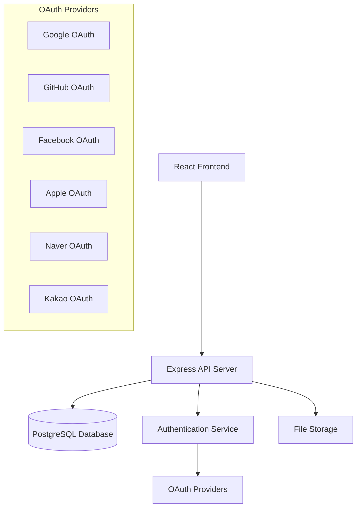

# Design Document

## Overview

Vibe Coding Notes는 현대적인 웹 기술을 사용하여 구축되는 풀스택 웹 애플리케이션입니다. React 기반의 프론트엔드와 Node.js/Express 백엔드, PostgreSQL 데이터베이스를 사용하여 확장 가능하고 유지보수가 용이한 아키텍처를 제공합니다.

## Architecture

### System Architecture



### Technology Stack

**Frontend:**

- React 18 with TypeScript
- Vite for build tooling
- Tailwind CSS for styling
- shadcn/ui for component library and design system
- React Router for navigation
- React Query for state management and API calls
- React Hook Form for form handling

**Backend:**

- Node.js with Express.js
- TypeScript for type safety
- Prisma ORM for database operations
- Passport.js for authentication
- bcrypt for password hashing
- JWT for session management

**Database:**

- PostgreSQL for primary data storage
- Redis for session storage and caching

**Infrastructure:**

- Docker for containerization
- Environment-based configuration

## Components and Interfaces

### Frontend Components

#### Core Components

- `App.tsx` - Main application component with routing
- `Layout.tsx` - Common layout wrapper with navigation
- `Header.tsx` - Navigation bar with authentication status
- `Footer.tsx` - Site footer

#### Authentication Components

- `LoginForm.tsx` - Email/password login form
- `SocialLogin.tsx` - Social authentication buttons
- `AuthGuard.tsx` - Route protection component

#### Note Components

- `NoteList.tsx` - Grid/list view of notes
- `NoteCard.tsx` - Individual note preview card
- `NoteDetail.tsx` - Full note view with comments
- `NoteEditor.tsx` - Note creation/editing form (owner only)
- `TagSelector.tsx` - Tag input and selection component

#### Comment Components

- `CommentList.tsx` - List of comments for a note
- `CommentItem.tsx` - Individual comment display
- `CommentForm.tsx` - Comment creation form
- `CommentEditor.tsx` - Comment editing form

#### UI Components

- `SearchBar.tsx` - Search input with filters
- `FilterPanel.tsx` - Category and tag filters
- `LikeButton.tsx` - Anonymous like functionality
- `Pagination.tsx` - Page navigation component

### Backend API Endpoints

#### Authentication Routes

```
POST /api/auth/login - Email/password login
POST /api/auth/register - User registration
GET /api/auth/logout - User logout
GET /api/auth/me - Get current user info
GET /api/auth/google - Google OAuth
GET /api/auth/github - GitHub OAuth
GET /api/auth/facebook - Facebook OAuth
GET /api/auth/apple - Apple OAuth
GET /api/auth/naver - Naver OAuth
GET /api/auth/kakao - Kakao OAuth
```

#### Notes Routes

```
GET /api/notes - Get all notes (with pagination and filters)
GET /api/notes/:id - Get specific note with comments
POST /api/notes - Create new note (owner only)
PUT /api/notes/:id - Update note (owner only)
DELETE /api/notes/:id - Delete note (owner only)
POST /api/notes/:id/like - Add anonymous like
```

#### Comments Routes

```
GET /api/notes/:noteId/comments - Get comments for a note
POST /api/notes/:noteId/comments - Create comment (authenticated users)
PUT /api/comments/:id - Update comment (owner or comment author)
DELETE /api/comments/:id - Delete comment (owner or comment author)
```

#### Tags and Categories Routes

```
GET /api/tags - Get all tags
GET /api/categories - Get all categories
POST /api/tags - Create new tag (owner only)
POST /api/categories - Create new category (owner only)
```

## Data Models

### User Model

```typescript
interface User {
  id: string;
  email: string;
  name: string;
  avatar?: string;
  role: "owner" | "visitor";
  provider:
    | "email"
    | "google"
    | "github"
    | "facebook"
    | "apple"
    | "naver"
    | "kakao";
  providerId?: string;
  createdAt: Date;
  updatedAt: Date;
}
```

### Note Model

```typescript
interface Note {
  id: string;
  title: string;
  content: string;
  excerpt: string;
  slug: string;
  authorId: string;
  categoryId: string;
  tags: Tag[];
  likeCount: number;
  published: boolean;
  createdAt: Date;
  updatedAt: Date;

  // Relations
  author: User;
  category: Category;
  comments: Comment[];
  likes: Like[];
}
```

### Comment Model

```typescript
interface Comment {
  id: string;
  content: string;
  noteId: string;
  authorId: string;
  parentId?: string; // For nested comments
  createdAt: Date;
  updatedAt: Date;

  // Relations
  note: Note;
  author: User;
  parent?: Comment;
  replies: Comment[];
}
```

### Category Model

```typescript
interface Category {
  id: string;
  name: string;
  slug: string;
  description?: string;
  color: string;
  createdAt: Date;

  // Relations
  notes: Note[];
}
```

### Tag Model

```typescript
interface Tag {
  id: string;
  name: string;
  slug: string;
  createdAt: Date;

  // Relations
  notes: Note[];
}
```

### Like Model

```typescript
interface Like {
  id: string;
  noteId: string;
  ipAddress: string;
  createdAt: Date;

  // Relations
  note: Note;
}
```

## Error Handling

### Frontend Error Handling

- Global error boundary for React component errors
- API error handling with user-friendly messages
- Form validation errors with inline display
- Network error handling with retry mechanisms

### Backend Error Handling

- Centralized error middleware
- Structured error responses with consistent format
- Input validation using Joi or Zod
- Database error handling and logging

### Error Response Format

```typescript
interface ErrorResponse {
  success: false;
  error: {
    code: string;
    message: string;
    details?: any;
  };
  timestamp: string;
}
```

## Testing Strategy

### Frontend Testing

- Unit tests for components using React Testing Library
- Integration tests for user flows
- E2E tests using Playwright or Cypress
- Visual regression tests for UI components

### Backend Testing

- Unit tests for business logic and utilities
- Integration tests for API endpoints
- Database tests with test database
- Authentication flow tests

### Test Coverage Goals

- Minimum 80% code coverage for critical paths
- 100% coverage for authentication and authorization logic
- Integration tests for all API endpoints
- E2E tests for core user journeys

## Security Considerations

### Authentication Security

- JWT tokens with appropriate expiration
- Secure password hashing with bcrypt
- OAuth implementation following best practices
- Session management with secure cookies

### Data Protection

- Input sanitization and validation
- SQL injection prevention through ORM
- XSS protection with content sanitization
- CSRF protection for state-changing operations

### Access Control

- Role-based access control (owner vs visitor)
- IP-based like tracking without personal data storage
- Secure API endpoints with proper authorization checks

## Performance Optimization

### Frontend Performance

- Code splitting and lazy loading
- Image optimization and lazy loading
- Caching strategies for API responses
- Bundle size optimization

### Backend Performance

- Database query optimization
- Caching with Redis for frequently accessed data
- Pagination for large datasets
- Connection pooling for database

### Monitoring

- Performance monitoring for API response times
- Error tracking and logging
- User analytics for feature usage
